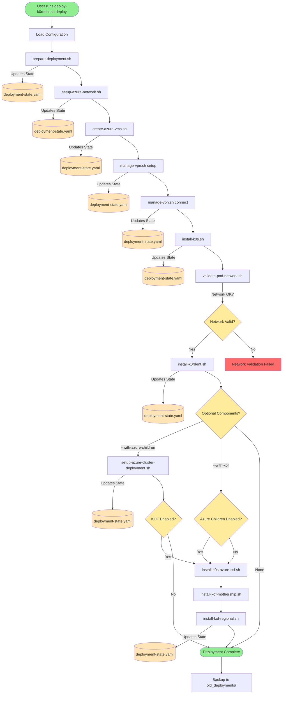
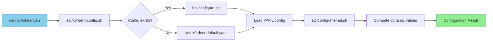
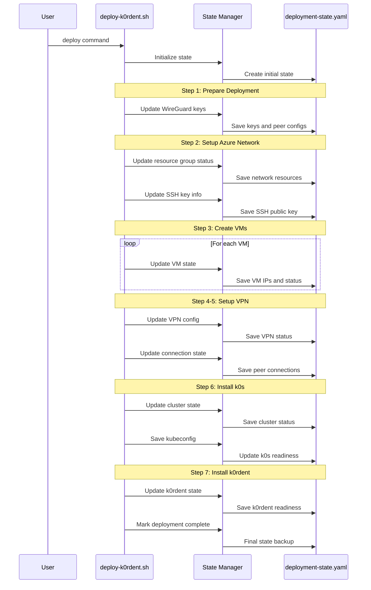
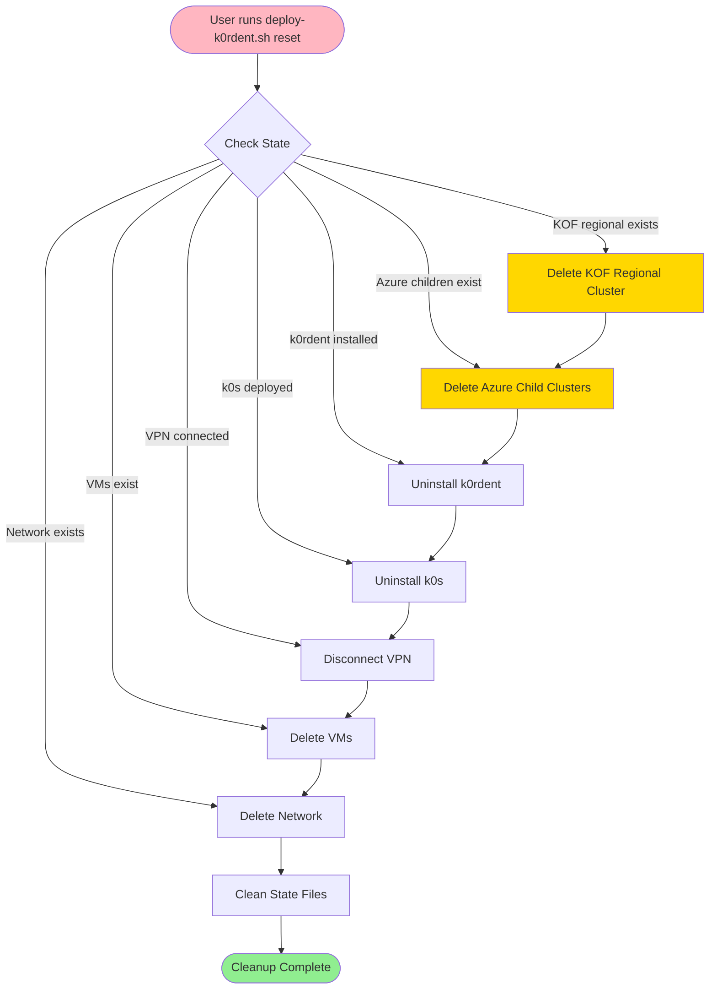
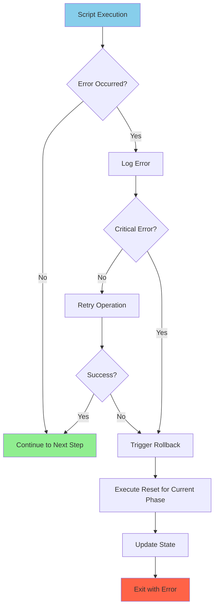

# k0rdent Azure Setup - Program Flow Diagram

## Overview
This document provides visual diagrams showing the program flow, script relationships, and state tracking mechanisms in the k0rdent Azure setup project.

## Main Deployment Flow



## Configuration Loading System



## Script Dependencies and Relationships

```mermaid
graph TD
    subgraph "Main Orchestrator"
        Main[deploy-k0rdent.sh]
    end
    
    subgraph "Configuration Layer"
        Config1[etc/k0rdent-config.sh]
        Config2[etc/config-internal.sh]
        Config3[bin/configure.sh]
        Config1 --> Config2
        Config1 --> Config3
    end
    
    subgraph "Common Functions"
        Common[etc/common-functions.sh]
    end
    
    subgraph "State Management"
        State[etc/state-management.sh]
    end
    
    subgraph "Deployment Scripts"
        Prep[bin/prepare-deployment.sh]
        Network[bin/setup-azure-network.sh]
        VMs[bin/create-azure-vms.sh]
        VPN[bin/manage-vpn.sh]
        K0s[bin/install-k0s.sh]
        Validate[bin/validate-pod-network.sh]
        K0rdent[bin/install-k0rdent.sh]
        SSH[bin/lockdown-ssh.sh]
    end
    
    subgraph "Optional Components"
        AzureSetup[bin/setup-azure-cluster-deployment.sh]
        CSI[bin/install-k0s-azure-csi.sh]
        KOFMother[bin/install-kof-mothership.sh]
        KOFRegional[bin/install-kof-regional.sh]
    end
    
    Main --> Config1
    Main --> Prep
    Main --> Network
    Main --> VMs
    Main --> VPN
    Main --> K0s
    Main --> K0rdent
    
    Prep --> Common
    Prep --> State
    Network --> Common
    Network --> State
    VMs --> Common
    VMs --> State
    VPN --> Common
    VPN --> State
    K0s --> Common
    K0s --> State
    K0s --> Validate
    Validate --> Common
    Validate --> State
    K0rdent --> Common
    K0rdent --> State
    SSH --> Common
    
    Main --> AzureSetup
    Main --> CSI
    Main --> KOFMother
    Main --> KOFRegional
    
    AzureSetup --> Common
    AzureSetup --> State
    CSI --> Common
    CSI --> State
    KOFMother --> Common
    KOFMother --> State
    KOFRegional --> Common
    KOFRegional --> State
    
    style Main fill:#FF6B6B
    style Common fill:#4ECDC4
    style State fill:#FFE66D
```



## State Tracking Timeline



## State File Structure

```yaml
# deployment-state.yaml structure
deployment:
  id: "unique-deployment-id"
  started_at: "timestamp"
  completed_at: "timestamp"
  
phases:
  prepare_deployment: true/false
  setup_network: true/false
  create_vms: true/false
  setup_vpn: true/false
  connect_vpn: true/false
  install_k0s: true/false
  install_k0rdent: true/false
  
resources:
  resource_group: "name"
  vnet: "name"
  subnet: "name"
  nsg: "name"
  ssh_key: "name"
  
vms:
  vm1:
    name: "vm-name"
    public_ip: "x.x.x.x"
    private_ip: "10.x.x.x"
    wireguard_ip: "192.168.100.x"
    status: "running"
    
wireguard:
  peers:
    laptop:
      public_key: "key"
      wireguard_ip: "192.168.100.1"
    vm1:
      public_key: "key"
      wireguard_ip: "192.168.100.x"
      
cluster:
  k0s_deployed: true/false
  k0rdent_ready: true/false
  kubeconfig_retrieved: true/false
```

## Reset/Cleanup Flow



## Error Handling and Recovery



## Key Features Illustrated

1. **Modular Architecture**: Each script handles a specific domain
2. **State-Driven**: All operations tracked in deployment-state.yaml
3. **Progressive Enhancement**: Each step builds on the previous
4. **Rollback Capability**: Reset reverses deployment in opposite order
5. **Configuration Flexibility**: YAML-based with dynamic computation
6. **Error Recovery**: State tracking enables resumption after failures

## Common Patterns

- **Check-then-act**: Scripts verify existing state before operations
- **State updates**: Every significant action updates deployment state
- **Shared functions**: Common operations centralized in library
- **Standard commands**: Consistent CLI interface across scripts
- **Idempotent design**: Safe to run scripts multiple times